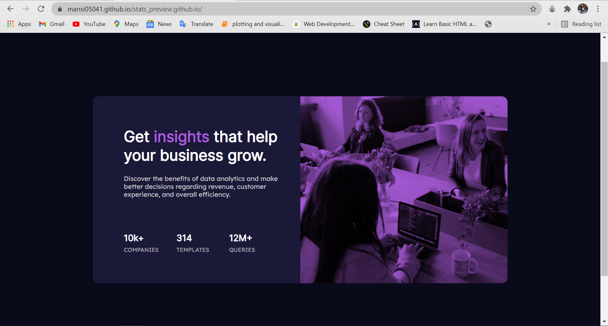

# Frontend Mentor - Stats preview card component
This is a solution to the [Stats preview card component challenge on Frontend Mentor](https://www.frontendmentor.io/challenges/stats-preview-card-component-8JqbgoU62). Frontend Mentor challenges help you improve your coding skills by building realistic projects. 

## Table of contents

- [Overview](#overview)
- [The challenge](#the-challenge)
- [Screenshot](#screenshot)
- [Links](#links)
- [My process](#my-process)
- [Built with](#built-with)
- [What I learned](#what-i-learned)
- [Continued development](#continued-development)
- [Useful resources](#useful-resources)
- [Author](#author)

## Overview
Completed challenge using CSS Grid 

### The challenge

Users should be able to:

- View the optimal layout depending on their device's screen size

### Screenshot



### Links

- Solution URL: [https://github.com/mansi05041/stats_preview.github.io]
- Live Site URL: [https://mansi05041.github.io/stats_preview.github.io/]

## My process

I proceed with desktop design with first . I have apply seperate media querries for both design (i.e desktop & mobile)

### Built with

- Semantic HTML5 markup
- CSS custom properties
- CSS Grid
- Mobile-first workflow

### What I learned

```css
.image_section{
    background-color:hsl(277, 64%, 61%) ;
    background-image: url(images/image-header-desktop.jpg);
    background-repeat: no-repeat;
    background-size: cover;
    background-blend-mode: multiply;
  }
```
I found setting image most challenging . 

### Continued development

In mobile design there are many problems especially in image . 
Much work is there in Mobile responsive Area

### Useful resources

- [w3schools](https://www.w3schools.com/css/css_rwd_mediaqueries.asp) - This helped me for understanding the media querry.
- [grid layout](https://grid.layoutit.com/) - This helped me in CSS Grid . It provides code according to your need.

## Author

- Frontend Mentor - [@mansi05041](https://www.frontendmentor.io/profile/mansi05041)
- Linkedin - [mansi joshi](https://www.linkedin.com/in/mansi-joshi-663aa81a0/)

